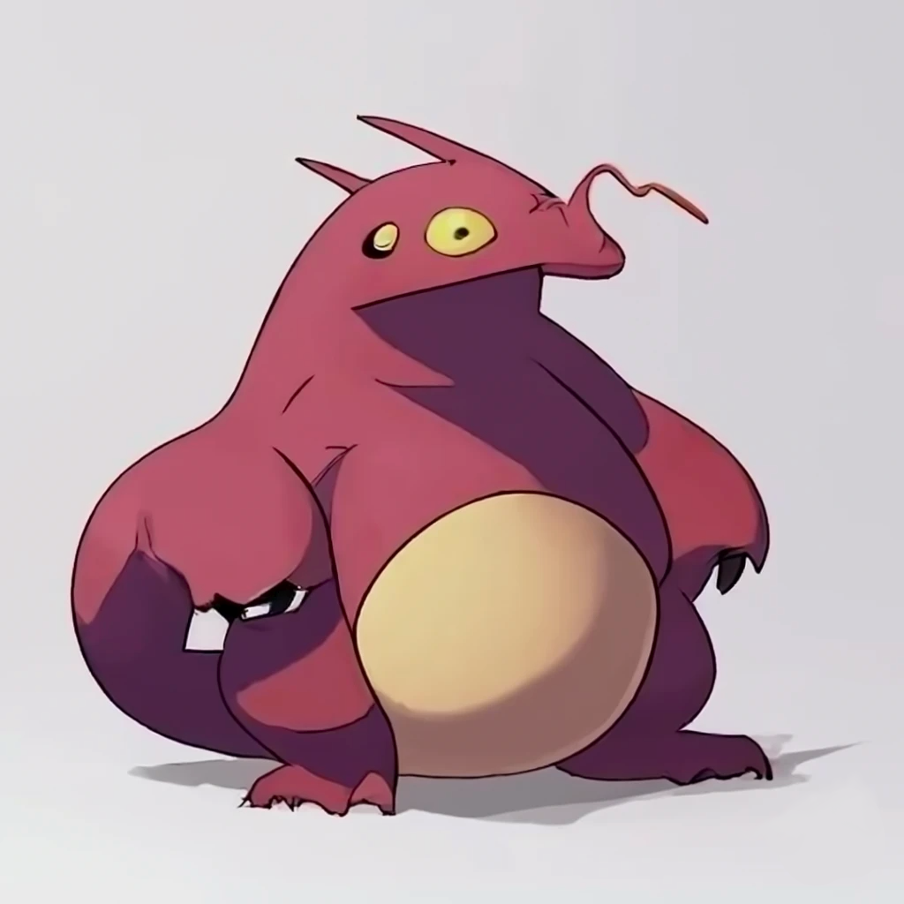

# Pikodex

<aside>
<strong>In this project you will:</strong> Build a wireframe, write CSS with Flexbox, generate HTML with Javascript, and write modular code
</aside>

## Gotta catch ‘em all! PIKOMON!!

Tarmus, Flink, Putron, and more!! You’ve been hired to build an online *Pikodex* for the relatively new adventure, battle cartoon. 

They haven’t been doing so well with sales and ratings, but they’re certain this online resource is going to change that. 

They’ve placed their faith in you - a team of super awesome developers. 

No doubt these Pikomon are *so* awesome that fans will come *swarming* once this Pikodex is up and running! 

### Here’s what the marketing team of Pikomon is asking for:

> At the top of the page should be the title, “Pikodex”, centered on the page. 
>
>Underneath this, all nine Pikomon and their details should be displayed in a three-column format. Each Pikomon display should have the following format: 
>
>The image for the Pikomon should be at the top. The name should be just beneath it. Beneath the name should be all the details for the pikomon.
>
>The creators of Pikomon are really hurting for fans, so they need all the help they can get. Do as much as you can to bring them more attention: loud fonts, bright colors, shadows, rounded borders, and more. They want you to have creative freedom, but if the site is just plain, all left aligned, black and white text… they’ll probably go out of business.
> 

Before you even think about coding, discuss and plan this project with your team. The first step of planning is to build a wireframe, this way you all have a clear goal in mind of what you’re building. Don’t worry about what colors or fonts you will use in the wireframe. Just create a general mockup of what the marketing team has described.
